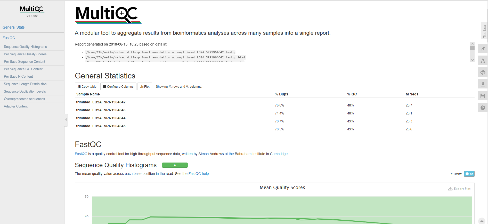
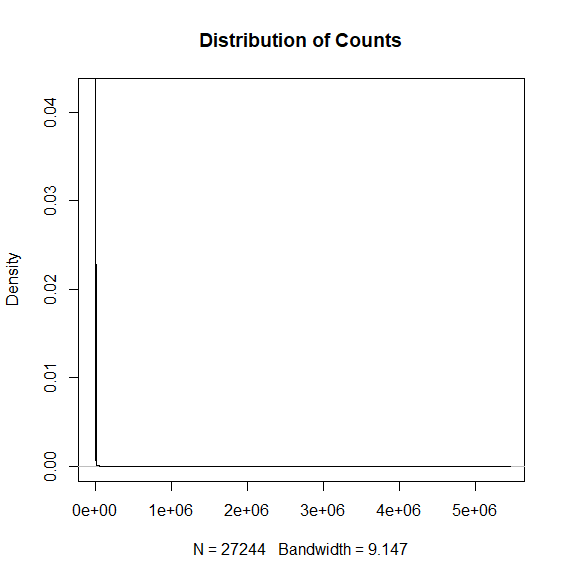
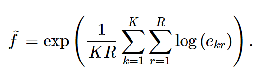
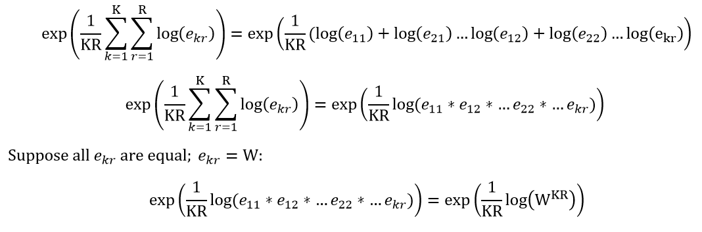
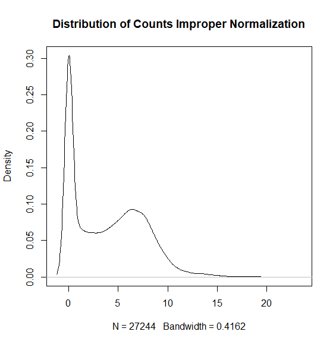
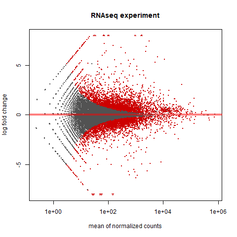

# RNA-Seq: Reference Genome, Differential Expression, and Functional Annotation
This repository is a usable, publicly available differential expression and functional annotation tutorial.
All steps have been provided for the UConn CBC Xanadu cluster here with appropriate headers for the Slurm scheduler that can be modified simply to run.  Commands should never be executed on the submit nodes of any HPC machine.  If working on the Xanadu cluster, you should use sbatch scriptname after modifying the script for each stage.  Basic editing of all scripts can be performed on the server with tools, such as nano, vim, or emacs.  If you are new to Linux, please use <a href="https://bioinformatics.uconn.edu/unix-basics/">this</a> handy guide for the operating system commands.  In this guide, you will be working with common bioinformatic file formats, such as <a href="https://en.wikipedia.org/wiki/FASTA_format">FASTA</a>, <a href="https://en.wikipedia.org/wiki/FASTQ_format">FASTQ</a>, <a href="https://en.wikipedia.org/wiki/SAM_(file_format)">SAM/BAM</a>, and <a href="https://en.wikipedia.org/wiki/General_feature_format">GFF3/GTF</a>. You can learn even more about each file format <a href="https://bioinformatics.uconn.edu/resources-and-events/tutorials/file-formats-tutorial/">here</a>. If you do not have a Xanadu account and are an affiliate of UConn/UCHC, please apply for one <a href="https://bioinformatics.uconn.edu/contact-us/">here</a>.
	

Contents

<ul class="toc_list">
<li><a href="#First_Point_Header">1 Overview and programs install</>
<li><a href="#Second_Point_Header">2 Accessing the data using sra-toolkit</a></li>
<li><a href="#Third_Point_Header">3 Quality control using sickle</a></li>
<li><a href="#Fourth_Point_Header">4 Aligning reads to a genome using hisat2</a></li>
<li><a href="#Fifth_Point_Header">5 Generating total read counts from alignment using htseq-count</a></li>
<li><a href="#Sixth_Point_Header">6 Pairwise differential expression with counts in R with DESeq2</a></li>
<li><a href="#EnTAP">7 EnTAP: Functional Annotation for Genomes</a></li>
 <li><a href="#Integration">8 Integrating the DE Results with the Annotation Results</a></li>
<li><a href="#Citation">Citations</a></li>
</ul>

<h2 id="First_Point_Header">Overview and programs install</h2>
In this tutorial we will be analyzing large yellow croaker (Larimichthys crocea) liver samples from the NCBI BioProject (https://www.ncbi.nlm.nih.gov/bioproject/280841) 
Experimental Design: 

Liver mRNA profiles large yellow croaker (Larimichthys crocea) species are sampled during various conditions namely, control group (LB2A), thermal stress group (LC2A), cold stress group (LA2A) and 21-day fasting group (LF1A) were generated by RNA-seq, using Illumina HiSeq 2000. 

We will use the control group (LB2A) and the thermal stress group (LC2A),

If performing headers 1-6 on a personal computer, continue onward. 

If performing headers 1-6 on the Xanadu cluster, it is important that after connecting via SSH the directory is set to

<pre style="color: silver; background: black;">cd /home/CAM/$USER/</pre> 

before proceeding. Your home directory contains 10TB of storage and will not pollute the capacities of other users on the cluster. 

The workflow may be cloned into the appropriate directory using the terminal command:
<pre style="color: silver; background: black;">-bash-4.2$ git clone https://github.com/wolf-adam-eily/refseq_diffexp_funct_annotation_uconn.git
-bash-4.2$ cd refseq_diffexp_funct_annotation_uconn
-bash-4.2$ ls  </pre>

If performing headers 1-6 on a local computer, it is recommended the command (in the cloned folder): 
<pre style="color: silver; background: black;">sh -e programs_installation
sh -e r_3.4.3_install
sudo Rscript r_packages_install </pre> 
is run to install <i><b>all</b></i> of the needed software for headers 1-6. If apt-get is not installed on your system, please install that first.
<h2 id="Second_Point_Header">Accessing the data using sra-toolkit </h2>

We will be downloading our data from the sequence-read-archives (SRA), a comprehensive collection of sequenced genetic data submitted to the NCBI by experimenters. The beauty of the SRA is the ease with which genetic data becomes accessible to any scientist with an internet connection, available for download in a variety of formats. Each run in the SRA has a unique identifier. The run may be downloaded using a module of software called the "sratoolkit" and its unique identifier. There are a variety of commands in the sratoolkit, which I invite you to investigate for yourself at https://www.ncbi.nlm.nih.gov/books/NBK158900/.

The data may be accessed at the following web page: 
https://www.ncbi.nlm.nih.gov/bioproject/28084 
LB2A : SRR1964642, SRR1964643 
LC2A : SRR1964644, SRR1964645 

and downloaded with:

<b>xanadu</b> 
Unlike a local terminal, commands in Xanadu must be concatenated into a single script with the required arguments for the Slurm scheduler. The script is subsequently submitted to the Slurm scheduler using the sbatch command. To initialize a script in Unix we use the nano command, which will produce the following window:
<pre style="color: silver; background: black;">
nano fastq_dumps.sh
 GNU nano 2.3.1            File: fastq_dumps.sh                                

				[ New File ] 
^G Get Help  ^O WriteOut  ^R Read File ^Y Prev Page ^K Cut Text  ^C Cur Pos
^X Exit      ^J Justify   ^W Where Is  ^V Next Page ^U UnCut Text^T To Spell</pre>

We now write our script with the appropriate <a href="https://bioinformatics.uconn.edu/resources-and-events/tutorials/xanadu/#Xanadu_6">Slurm arguments</a> followed by our commands:

<pre style="color: silver; background: black;">  GNU nano 2.3.1          File: fastq_dumps.sh                  Modified  
#!/bin/bash
#SBATCH --job-name=fastq_dumps.sh
#SBATCH -N 1
#SBATCH -n 1
#SBATCH -c 8
#SBATCH --partition=general
#SBATCH --mail-type=END
#SBATCH --mail-user=your_email@uconn.edu
#SBATCH --mem=50G
#SBATCH -o fastq_dumps_%j.out
#SBATCH -e fastq_dumps_%j.err
module load sratoolkit
fastq-dump SRR1964642
mv SRR1964642.fastq LB2A_SRR1964642.fastq
fastq-dump SRR1964643
mv SRR1964643.fastq LB2A_SRR1964643.fastq
				
				[ New File ] 
^G Get Help  ^O WriteOut  ^R Read File ^Y Prev Page ^K Cut Text  ^C Cur Pos
^X Exit      ^J Justify   ^W Where Is  ^V Next Page ^U UnCut Text ^T To Spell</pre>

We now press CTRL+X which will ask us if we wish to save, simply type "y" to confirm that we do want to save. Next we will be prompted with the file name, we simply hit enter here to save our file (or, if you like, you may change the file name). Now that we have our script, we may run it with the command:

<pre style="color: silver; background: black;">-bash-4.2$ sbatch fastq_dumps.sh</pre>

It is advised that you familiarize yourself with the arguments for the Slurm scheduler. While it may seem as though running your commands locally will be more efficient due to the hassle of not initializing and writing scripts, do not fall for that trap! The capacity of the Slurm scheduler far exceeds the quickness of entering the commands locally. While the rest of this tutorial will not include the process of initializing and writing the Slurm arguments in a script in its coding, know that the Xanadu scripts in the cloned directory <i>do</i> contain the Slurm arguments. However, before running any cloned Xanadu script, you must "nano" and enter your appropriate email address!

<b>local</b>
<pre style="color: silver; background: black;">fastq-dump SRR1964642
fastq-dump SRR1964643</pre>

Unless authorized, you cannot add any packages or software to Xanadu. However, you can see all of the software pre-loaded with the following command:
<pre style="color: silver; background: black;">module avail</pre>

Because of this, it is important to manually load modules to be used in the Xanadu bash. For those on a local computer, the "programs_installation" file installs the software globally and in the executable path, removing any need for loading the module in the terminal.

Now we must repeat the fastq-dump command for SRR1964644 and SRR1964645 samples, or alternatively run either of the following commands in the cloned directory (it is important to use the "nano" command to enter your appropriate email address before running this code on Xanadu): 

<pre style="color: silver; background: black;">-bash-4.2$ sbatch fastq_dump_xanadu.sh</pre>
or
<pre style="color: silver; background: black;">sh -e fastqdump_and_trim_local</pre>

The first command will simply download the four fastq files to /home/CAM/your_user_name/refseq_diffexp_funct_annotation_uconn. If proceeding through this headers 1-6 on a personal computer or laptop without access to Xanadu, run the second command. This command will combine the fastq-dump with the next step, quality control: downloading a fastq file, trimming that file, and then removing the untrimmed file. This is recommended if disk space is an issue (the four files combined consume about 75GB of disk space).
Once download is completed, the files were renamed according to the samples for easy identification using the "mv" command. If the first command was run, you should see the following files in your folder: 
<pre style="color: silver; background: black;">-bash-4.2$ ls &#42;fastq
<strong>LB2A_SRR1964642.fastq
LB2A_SRR1964643.fastq
LC2A_SRR1964644.fastq
LC2A_SRR1964645.fastq</strong></pre>

Let's have a look at the content of one of the fastq-files:

<pre style="color: silver; background: black;">-bash-4.2$ head -n 12 LB2A_SRR1964642.fastq
@SRR1964642.1 FCC355RACXX:2:1101:1476:2162 length=90
CAACATCTCAGTAGAAGGCGGCGCCTTCACCTTCGACGTGGGGAATCGCTTCAACCTCACGGGGGCTTTCCTCTACACGTCCTGTCCGGA
+SRR1964642.1 FCC355RACXX:2:1101:1476:2162 length=90
?@@D?DDBFHHFFGIFBBAFG:DGHDFHGHIIIIC=D<:?BBCCCCCBB@BBCCCB?CCBB<@BCCCAACCCCC>>@?@88?BCACCBB>
@SRR1964642.2 FCC355RACXX:2:1101:1641:2127 length=90
NGCCTGTAAAATCAAGGCATCCCCTCTCTTCATGCACCTCCTGAAATAAAAGGGCCTGAATAATGTCGTACAGAAGACTGCGGCACAGAC
+SRR1964642.2 FCC355RACXX:2:1101:1641:2127 length=90
#1=DDFFFHHHHGJJJJJIIIJIJGIIJJJIJIJJGIJIJJJJIJJJJJJIJJJIJJJJJJJGIIHIGGHHHHHFFFFFDEDBDBDDDDD
@SRR1964642.3 FCC355RACXX:2:1101:1505:2188 length=90
GGACAACGCCTGGACTCTGGTTGGTATTGTCTCCTGGGGAAGCAGCCGTTGCTCCACCTCCACTCCTGGTGTCTATGCCCGTGTCACCGA
+SRR1964642.3 FCC355RACXX:2:1101:1505:2188 length=90CCCFFFFFHHFFHJJJIIIJHHJJHHJJIJIIIJEHJIJDIJJIIJJIGIIIIJGHHHHFFFFFEEEEECDDDDEDEDDDDDDDADDDDD</pre>

We see that for our first three runs we have information about the sampled read including its length followed by the nucleotide read and then a "+" sign. The "+" sign marks the beginning of the corresponding scores for each nucleotide read for the nucleotide sequence preceding the "+" sign. 

<h2 id="Third_Point_Header">Quality control using sickle</h2>

<pre style="color: silver; background: black;">-bash-4.2$ module load sickle

-bash-4.2$ sickle

<strong>Usage</strong>: sickle <command> [options]

<strong>Command</strong>:
pe	paired-end sequence trimming
se	single-end sequence trimming

--help, display this help and exit
--version, output version  Information and exit</pre>

We have single-end sequences. 

<pre style="color: silver; background: black;">-bash-4.2$ sickle se

<strong>Usage</strong>: sickle se [options] -f <fastq sequence file> -t <quality type> -o <trimmed fastq file>

<strong>Options</strong>:
-f, --fastq-file, Input fastq file (required)
-t, --qual-type, Type of quality values (solexa (CASAVA < 1.3), illumina (CASAVA 1.3 to 1.7), sanger (which is CASAVA >= 1.8)) (required)
-o, --output-file, Output trimmed fastq file (required)
-q, --qual-threshold, Threshold for trimming based on average quality in a window. Default 20.
-l, --length-threshold, Threshold to keep a read based on length after trimming. Default 20.
-x, --no-fiveprime, Don't do five prime trimming.
-n, --trunc-n, Truncate sequences at position of first N.
-g, --gzip-output, Output gzipped files.
--quiet, Don't print out any trimming  Information
--help, display this help and exit
--version, output version  Information and exit</pre>

The quality may be any score from 0 to 40. The default of 20 is much too low for a robust analysis. We want to select only reads with a quality of 35 or better. Additionally, the desired length of each read is 50bp. Again, we see that a default of 20 is much too low for analysis confidence. We want to select only reads whose lengths exceed 45bp. Lastly, we must know the scoring type. While the quality type is not listed on the SRA pages, most SRA reads use the "sanger" quality type. Unless explicitly stated, try running sickle using the sanger qualities. If an error is returned, try illumina. If another error is returned, lastly try solexa.

Let's put all of this together for our sickle script using our downloaded fastq files:

<b>xanadu (contained within the Slurm script, do not run this alone in the terminal!)</b>
<pre style="color: silver; background: black;">module load sickle
sickle se -f LB2A_SRR1964642.fastq -t sanger -o trimmed_LB2A_SRR1964642.fastq -q 30 -l 50</pre>

<b>local</b>
<pre style="color: silver; background: black;">sickle se -f LB2A_SRR1964642.fastq -t sanger -o trimmed_LB2A_SRR1964642.fastq -q 30 -l 50</pre></pre>

After this point the tutorial will not specify Xanadu or local in its coding excerpts, but assume that the module has been loaded. However, still use the shell scripts for your setups, as they remain differentiated.

This must be repeated for all four files. If the previous header was run locally, this step has already been performed. Those on Xanadu can run the following shell script to perform the steps:
<pre style="color: silver; background: black;">-bash-4.2$ sbatch fastq_trimming_xanadu.sh</pre>
 
Following the sickle run, the resulting file structure will look as follows:
<pre style="color: silver; background: black;">-bash-4.2$ ls trimmed&#42;							
<strong>trimmed_LB2A_SRR1964642.fastq
trimmed_LB2A_SRR1964643.fastq
trimmed_LC2A_SRR1964644.fastq
trimmed_LC2A_SRR1964645.fastq</strong></pre>
Examine the .out file generated during the run.  It will provide a summary of the quality control process.
<pre style="color: silver; background: black;">Input Reads: 26424138 Surviving: 21799606 (82.50%) Dropped: 4624532 (17.50%)</pre>

It is helpful to see how the quality of the data has changed after using sickle. To do this, we will be using the commandline versions of <a href="https://www.bio Informatics.babraham.ac.uk/projects/fastqc/INSTALL.txt">fastqc</a> and <a href="http://multiqc. Info/docs/">MultiQC</a>. These two programs simply create reports of the average quality of our trimmed reads, with some graphs. There is no way to view a --help menu for these programs in the command-line. However, their use is quite simple, we simply run "fastqc <trimmed_fastq>" or "multiqc -f -n trimmed trimmed*". Do not worry too much about the options for MultiQC! Let's write our script:

<pre style="color: silver; background: black;">-bash-4.2$ nano quality_control.sh

  GNU nano 2.3.1                                                    File: quality_control.sh                                                                                                                

#!/bin/bash
#SBATCH --job-name=quality_control
#SBATCH --mail-user=
#SBATCH --mail-type=ALL
#SBATCH -n 1
#SBATCH -N 1
#SBATCH -c 16
#SBATCH --mem=120G
#SBATCH -o quality_control_%j.out
#SBATCH -e quality_control_%j.err
#SBATCH --partition=general

export TMPDIR=/home/CAM/$USER/tmp/

module load fastqc
module load MultiQC

fastqc trimmed_LB2A_SRR1964642.fastq
fastqc trimmed_LB2A_SRR1964643.fastq
fastqc trimmed_LC2A_SRR1964644.fastq
fastqc trimmed_LC2A_SRR1964645.fastq
multiqc -f -n trimmed trimmed*

                                                                                             [ Read 26 lines ]
^G Get Help                       ^O WriteOut                       ^R Read File                      ^Y Prev Page                      ^K Cut Text                       ^C Cur Pos
^X Exit                           ^J Justify                        ^W Where Is                       ^V Next Page                      ^U UnCut Text                     ^T To Spell
</pre>
 
<pre style="color: silver; background: black;">-bash-4.2$ sbatch quality_control.sh</pre>

fastqc will create the files "trimmed_file_fastqc.html". To have a look at one, we need to move all of our "trimmed_file_fastqc.html" files into a single directory, and then <a href="https://www.techrepublic.com/article/how-to-use-secure-copy-for-file-transfer/">secure copy</a> that folder to our local directory. Then, we may open our files! If that seems like too much work for you, you may open the files directly through this github. Simply click on any "html" file and you may view it in your browser immediately. Because of this, the steps mentioned above will not be placed in this tutorial.

This script will also create a directory "trimmed_data". Let's look inside of that directory:

<pre style="color: silver; background: black;">-bash-4.2$ cd trimmed_data
-bash-4.2$ ls 
<strong>multiqc_fastqc.txt         multiqc.log
multiqc_general_stats.txt  multiqc_sources.txt
</strong></pre>

Let's have a look at the file format from fastqc and multiqc. When loading the fastqc file, you will be greeted with this screen:

There are some basic statistics which are all pretty self-explanatory. Notice that none of our sequences fail the quality report! It would be concerning if we had even one because this report is from our trimmed sequence! The same thinking applies to our sequence length. Should the minimum of the sequence length be below 45, we would know that sickle had not run properly. Let's look at the next index in the file:

This screen is simply a <a href="https://en.wikipedia.org/wiki/Box_plot">box-and-whiskers plot</a> of our quality scores per base pair. Note that there is a large variance and lower mean scores (but still about in our desired range) for base pairs 1-5. These are the primer sequences! I will leave it to you to ponder the behavior of this graph. If you're stumped, you may want to learn how <a href="https://www.illumina.com/techniques/sequencing.html">Illumina sequencing"</a> works.

Our next index is the per sequence quality scores:

This index is simply the total number of base pairs (y-axis) which have a given quality score (x-axis). This plot is discontinuous and discrete, and should you calculate the <a href="https://en.wikipedia.org/wiki/Riemann_sum">Riemann sum</a> the result is the total number of base pairs present across all reads.
	
The last index at which we are going to look is the "Overrepresented Sequences" index:

This is simply a list of sequences which appear disproportionately in our reads file. The reads file actually includes the primer sequences for this exact reason. When fastqc calculates a sequence which appears many times beyond the expected distribution, it may check the primer sequences in the reads file to determine if the sequence is a primer. If the sequence is not a primer, the result will be returned as "No Hit". Sequences which are returned as "No Hit" are most likely highly expressed genes.

We see that our multiqc file has the same indices as our fastqc files, but is simply the mean of all the statistics across our fastqc files:

<h2 id="Fourth_Point_Header">Aligning reads to a genome using hisat2</h2>
Building an Index: 
<a href="https://ccb.jhu.edu/software/hisat2/manual.shtml">HISAT2</a> is a fast and sensitive aligner for mapping next generation sequencing reads against a reference genome.

In order to map the reads to a reference genome, first we must download the reference genome! Then we must make an index file. We will be downloading the reference genome (https://www.ncbi.nlm.nih.gov/genome/12197) from the ncbi database, using the wget command.
<pre style="color: silver; background: black;">wget ftp://ftp.ncbi.nlm.nih.gov/genomes/all/GCF/000/972/845/GCF_000972845.1_L_crocea_1.0/GCF_000972845.1_L_crocea_1.0_genomic.fna.gz
gunzip GCF_000972845.1_L_crocea_1.0_genomic.fna.gz</pre>
If you are feeling prudent, you can install the genomic, transcriptomic, and proteomic fastas (yes, all will be used in this tutorial, it is advised you download them now) with the command:
<pre style="color: silver; background: black;">sh -e genomic_and_protein_downloads</pre>
We will use the hisat2-build option to make a HISAT index file for the genome. It will create a set of files with the suffix .ht2, these files together build the index. What is an index and why is it helpful? Genome indexing is the same as indexing a tome, like an encyclopedia. It is much easier to locate information in the vastness of an encyclopedia when you consult the index, which is ordered in an easily navigatable way with pointers to the location of the information you seek within the encylopedia. Genome indexing is thus the structuring of a genome such that it is ordered in an easily navigatable way with pointers to where we can find whichever gene is being aligned. The genome index along with the trimmed fasta files are all you need to align the reads to the reference genome (the build command is included in the genome_indexing_and_alignment* files, so it is not necessary to run now).
<pre style="color: silver; background: black;">-bash-4.2$ module load hisat2
-bash-4.2$ hisat2-build
<strong>Usage: hisat2-build</strong> [options] <reference_in> <bt2_index_base>
reference_in                comma-separated list of files with ref sequences
hisat2_index_base           write ht2 data to files with this dir/basename

Options:
    -p                      number of threads</pre></strong>

-bash-4.2$ hisat2-build -p 4 GCF_000972845.1_L_crocea_1.0_genomic.fna L_crocea

After running the command, the following files will be generated as part of the index.  To refer to the index for  mapping the reads in the next step, you will use the file prefix, which in this case is: L_crocea
<pre style="color: silver; background: black;">-bash-4.2$ ls &#42;ht2
<strong>L_crocea.1.ht2
L_crocea.2.ht2
L_crocea.3.ht2
L_crocea.4.ht2
L_crocea.5.ht2
L_crocea.6.ht2
L_crocea.7.ht2
L_crocea.8.ht2</strong></pre>

Aligning the reads using HISAT2: 
Once we have created the index, the next step is to align the reads with HISAT2 using the index we created. The program will give the output in SAM format. We will not delve into the intricacies of the SAM format here, but it is recommended to peruse https://en.wikipedia.org/wiki/SAM_(file_format) again to garner a greater understanding. We align our reads with the following code:
<pre style="color: silver; background: black;">-bash-4.2$ module load hisat2
-bash-4.2$ hisat2
<strong>Usage</strong>: hisat2 [options]&#42; -x <ht2-idx>  [-S <sam>]
-x <ht2-idx>        path to the Index-filename-prefix (minus trailing .X.ht2) 

<strong>Options</strong>:
-q                  query input files are FASTQ .fq/.fastq (default)
-p                  number threads
--dta               reports alignments tailored for transcript assemblers

hisat2 -p 4 --dta -x ../index/L_crocea -q ../quality_control/trim_LB2A_SRR1964642.fastq -S trim_LB2A_SRR1964642.sam</pre>

The above must be repeated for all the files. You may run:
<pre style="color: silver; background: black;">-bash-4.2$ sbatch genome_indexing_and_alignment_xanadu.sh</pre>
or
<pre style="color: silver; background: black;">sh -e genome_indexing_and_alignment_local</pre>

to process all four files appropriate for your setup.

Once the mapping have been completed, the file structure is as follows:
<pre style="color: silver; background: black;">-bash-4.2$ ls &#42;sam
<strong>trim_LB2A_SRR1964642.sam
trim_LB2A_SRR1964643.sam
trim_LC2A_SRR1964644.sam
trim_LC2A_SRR1964645.sam</strong></pre>

When HISAT2 completes its run, it will summarize each of it’s alignments, and it is written to the standard error file, which can be found in the same folder once the run is completed.

<pre style="color: silver; background: black;">-bash-4.2$ head -n 20 hisat2&#42;err
21799606 reads; of these:
  21799606 (100.00%) were unpaired; of these:
    1678851 (7.70%) aligned 0 times
    15828295 (72.61%) aligned exactly 1 time
    4292460 (19.69%) aligned >1 times
92.30% overall alignment rate</pre>

Let's have a look at the SAM file:

<pre style="color: silver; background: black;">-bash-4.2$ head trimmed_LB2A_SRR1964642.sam
@HD VN:1.0 SO:unsorted
@SQ SN:NW_017607850.1 LN:6737
@SQ SN:NW_017607851.1 LN:5396
@SQ SN:NW_017607852.1 LN:5050
@SQ SN:NW_017607853.1 LN:5873
@SQ SN:NW_017607854.1 LN:5692
@SQ SN:NW_017607855.1 LN:11509
@SQ SN:NW_017607856.1 LN:12722
@SQ SN:NW_017607857.1 LN:42555
@SQ SN:NW_017607858.1 LN:11917</pre>

After reading up on the SAM file format, you know that the "@" sign means that we are in the headings section, not the alignment section! The sam file is quite large so there is little purpose in scrolling to find the alignments section (the file is also much too large for using the "grep" command to locate the alignment section). Because of the density of the sam file, it is compressed to binary to create a more easily tractable file for manipulation by future programs. We convert the sam file to binaryam with the following command:

<pre style="color: silver; background: black;">-bash-4.2$ module load samtools
-bash-4.2$ samtools
<strong>Usage</strong>:   samtools <command> [options]

<strong>Commands</strong>:
  -- Indexing
     dict           create a sequence dictionary file
     faidx          index/extract FASTA
     index          index alignment

  -- Editing
     calmd          recalculate MD/NM tags and '=' bases
     fixmate        fix mate  Information
     reheader       replace BAM header
     targetcut      cut fosmid regions (for fosmid pool only)
     addreplacerg   adds or replaces RG tags
     markdup        mark duplicates

  -- File operations
     collate        shuffle and group alignments by name
     cat            concatenate BAMs
     merge          merge sorted alignments
     mpileup        multi-way pileup
     sort           sort alignment file
     split          splits a file by read group
     quickcheck     quickly check if SAM/BAM/CRAM file appears intact
     fastq          converts a BAM to a FASTQ
     fasta          converts a BAM to a FASTA

  -- Statistics
     bedcov         read depth per BED region
     depth          compute the depth
     flagstat       simple stats
     idxstats       BAM index stats
     phase          phase heterozygotes
     stats          generate stats (former bamcheck)

  -- Viewing
     flags          explain BAM flags
     tview          text alignment viewer
     view           SAM<->BAM<->CRAM conversion
     depad          convert padded BAM to unpadded BAM
</pre>

We are truly only interested in sorting our SAM files.

<pre style="color: silver; background: black;">-bash-4.2$ samtools sort

<strong>Usage</strong>: samtools sort [options...] [in.bam]
<strong>Options</strong>:
  -l INT     Set compression level, from 0 (uncompressed) to 9 (best)
  -m INT     Set maximum memory per thread; suffix K/M/G recognized [768M]
  -n         Sort by read name
  -t TAG     Sort by value of TAG. Uses position as secondary index (or read name if -n is set)
  -o FILE    Write final output to FILE rather than standard output
  -T PREFIX  Write temporary files to PREFIX.nnnn.bam
      --input-fmt-option OPT[=VAL]
               Specify a single input file format option in the form
               of OPTION or OPTION=VALUE
  -O, --output-fmt FORMAT[,OPT[=VAL]]...
               Specify output format (SAM, BAM, CRAM)
      --output-fmt-option OPT[=VAL]
               Specify a single output file format option in the form
               of OPTION or OPTION=VALUE
      --reference FILE
               Reference sequence FASTA FILE [null]
  -@, --threads INT
               Number of additional threads to use [0]
</pre>

The sort function converts SAM files to BAM automatically. Therefore, we can cut through most of these options and do a simple "samtools sort -o <output.bam> <inupt.sam>. Let's write our command:
<pre style="color: silver; background: black;">-bash-4.2$ samtools sort -@ 4 -o sort_trim_LB2A_SRR1964642.bam trimmed_LB2A_SRR1964642.sam</pre>

All samples may be run by executing the following command:
<pre style="color: silver; background: black;">-bash-4.2$ sbatch sam_to_bam_xanadu.sh</pre>
or
<pre style="color: silver; background: black;">sh -e sam_to_bam_local</pre>
appropriate for your set-up.

Once the conversion is done you will have the following files in the directory.
<pre style="color: silver; background: black;">-bash-4.2$ ls sort&#42;
<strong>sort_trim_LB2A_SRR1964642.bam
sort_trim_LB2A_SRR1964643.bam
sort_trim_LC2A_SRR1964644.bam
sort_trim_LC2A_SRR1964645.bam</strong></pre>

<h2 id="Fifth_Point_Header">Generating total read counts from alignent using htseq-count</h2>
Now we will be using the <a href="http://htseq.readthedocs.io/en/master/count.htmhtseq-count">htseq-count</a> function of the module htseq to count the reads which have mapped to the genome. The thought behind htseq-count is quite intuitive, enumerating matching alignments into a "counts" file. However, this belies the complexity of alignment counting. htseq is actually a Python module. Because of this, you'll notice something strange if you load it into the submit node:
<pre style="color: silver; background: black;">-bash-4.2$ module load htseq
(0.9.1) -bash-4.2$</pre>

We are "logged in" to a new shell! Let's try viewing the help menu:
<pre style="color: silver; background: black;">-bash-4.2$ module load htseq
(0.9.1) -bash-4.2$ htseq
<strong>-bash: htseq: command not found</strong>
</pre>

Let's try viewing the help menu for htseq-count:
<pre style="color: silver; background: black;">-bash-4.2$ module load htseq
(0.9.1) -bash-4.2$ htseq-count</pre>

Your terminal should become hung up on whitespace. Because hsteq operates as a shell (within our shell), if we try to run the command with no input then it gets stuck in an infinite loop! Press CTRL + C to kill the infinite loop and unload the module to acccess your normal shell:

<pre style="color: silver; background: black;">-bash-4.2$ module unload htseq</pre>

Because of this behavior, you will have to trust me on our choice of options. But we run htseq count with the following commands:

<pre style="color: silver; background: black;">-bash-4.2$ module load htseq
-bash-4.2$ htseq-count -s no -r pos -t gene -i Dbxref -f bam ../mapping/sort_trim_LB2A_SRR1964642.bam GCF_000972845.1_L_crocea_1.0_genomic.gff > LB2A_SRR1964642.counts</pre>

<pre style="color: silver; background: black;"><strong>Usage</strong>: htseq-count [options] alignment_file gff_file</pre>
<strong>Options</strong>:
  -f SAMTYPE, --format=SAMTYPE
                        type of  data, either 'sam' or 'bam'
                        (default: sam)
  -r ORDER, --order=ORDER
                        'pos' or 'name'. Sorting order of
                        (default: name). Paired-end sequencing data must be
                        sorted either by position or by read name, and the
                        sorting order must be specified. Ignored for single-
                        end data.
  -s STRANDED, --stranded=STRANDED
                        whether the data is from a strand-specific assay.
                        Specify 'yes', 'no', or 'reverse' (default: yes).
                        'reverse' means 'yes' with reversed strand
                        interpretation
  -t FEATURETYPE, --type=FEATURETYPE
                        feature type (3rd column in GFF file) to be used, all
                        features of other type are ignored (default, suitable
                        for Ensembl GTF files: exon)
  -i IDATTR, --idattr=IDATTR
                        GFF attribute to be used as feature ID (default,
                        suitable for Ensembl GTF files: gene_id)</pre>

 
The above command should be repeated for all other BAM files as well. You can process all the BAM files locally with the command:
<pre style="color: silver; background: black;">sh -e htseq_count</pre>
or on Xanadu with (do not forget to nano the script to insert your email):
<pre style="color: silver; background: black;">-bash-4.2$ sbatch htseq_count.sh</pre>
Once all the bam files have been counted, we will be having the following files in the directory. 
<pre style="color: silver; background: black;">-bash-4.2$ ls &#42;counts
<strong>sort_trim_LB2A_SRR1964642.counts
sort_trim_LB2A_SRR1964643.counts
sort_trim_LC2A_SRR1964644.counts
sort_trim_LC2A_SRR1964645.counts</strong></pre>

Let's have a look at the contents of a counts file:
<pre style="color: silver; background: black;">-bash-4.2$ head sort_trim_LB2A_SRR1964642.counts
GeneID:104917625	18
GeneID:104917626	7
GeneID:104917627	0
GeneID:104917628	199
GeneID:104917629	71
GeneID:104917630	23
GeneID:104917631	111
GeneID:104917632	25
GeneID:104917634	276
GeneID:104917635	254</pre>

We see the layout is quite straightforward, with two columns separated by a tab. The first column identifies the gene from the eponymous sample and the second column is the number of mRNA strands from the row's gene found in the sample. This setup is perfect for our next task, identifying differentially expressed genes.

<h2 id="Sixth_Point_Header">Pairwise differential expression with counts in R using DESeq2</h2>
This part of the tutorial <i>must</i> be run locally. To download the appropriate files to your local computer, we will use the secure copy client, "scp". Close your Xanadu connection and run the following code:
<pre style="color: silver; background: black;">-bash-4.2$ exit
<strong>logout
Connection to xanadu-submit-ext.cam.uchc.edu closed.</strong>
user@user$ scp your.user.name@xanadu-submit-ext.cam.uchc.edu:/path/to/counts/&#42;.counts /path/to/local/destination</pre>
Voila! Piece of cake.
To identify differentially expressed genes, We will use the DESeq2 package within Bioconductor in R to perform normalization and statistical analysis of differences among our two sample groups. This R-code is executed in RStudio for R version 3.4.3 (if the r_installation file did not properly install R 3.4.3 you may visit https://linode.com/docs/development/r/how-to-install-r-on-ubuntu-and-debian/ to troubleshoot). Note that Bioconductor will not run on any previous version of R in Linux, so it is imperative that you successfully install R 3.4.3). For our differential expression analysis, we will be using three types of graphs to visualize the data: Bland-Altman (MA), heatmap, and PCA plots. Let's review each plot before diving in:

<b>Bland-Altman(MA) Plot</b>
The Bland-Altman plot is a binary analysis, gathering information on the relationships between two-sets of data. Because we have four sets of data, we will be breaking our data into two separate groups (LB2A and LC2A), then generating two superimposed plots comparing each member of the two groups to each member of the other group. Before we go further, what <i>is</i> a Bland-Altman plot? An MA plot is the comparison of the log-differences for two datasets to the log-averages. That is:

<pre {
	font-family: Cambria,Georgia,serif;
	font-size: 13px;
	font-style: normal;
	font-variant: normal;
	font-weight: 400;
	line-height: 18.57px;
}><strong><i>M</i> = log2(D1/D2) = log2(D1)-log2(D2)
<i>A</i> = &frac12;log2(D1D2) = &frac12;(log2(D1)+log2(D2))</strong></pre>
with D1 and D2 being datasets 1 and 2, respectively. We plot M on the vertical axis and A on the horizontal axis. We see here that should two datapoints from datasets 1 and 2 be equal, they will plot at (D1==D2, 0). Therefore, should our entire plot run along y=0, it is safe to say, that for us, none of our genes were differentially expressed. However, should there be large deviations from y=0, we are provided with insight that we may have differentially expressed genes.

<b>Heatmap</b>
Heatmaps are the most readily readable visualizations for determining differential expression, unless, like me, you are colorblind! Heatmaps are discrete plots. That is, the values along the x and y axis move in integer increments, with no places in-between. Typically, the x-and-y axes contain different types of information about each dataset, and combine to capture the whole image of the dataset. For us, we may find it useful to make one axis our groups (our four datasets) and the other axis the genes sampled from those datasets. Now each cell in our grid will correspond to the expression of a gene from a sample. We then assign a color-palette to each possible range of gene expression. For instance, an expression between 300-500 may be blue while an expression of 501-1000 may be violet. After coloring all of our cells responsibly, we now have simple, discrete snapshots of each datasets expression distribution. Should we notice that two groups have very similar looking snapshots, we may cluster those groups safely with the assumption that they do not share differentially expressed genes, and therefore belong to the same space. 

<b>Principal Component Analysis(PCA)</b>
Principal-Component-Analysis is far too complex and nuanced to go into detail here. However, you may download an entire tutorial <a href="https://docs.wixstatic.com/ugd/d07f4e_eafc861e1cff411e88b89cf2739e8565.pdf">here</a> for differential expression analysis in R which covers much of what we are about to do, including Principal Component Analysis (pages 15-18, "singular-value-decomposition"). Now! Let's get coding!

<pre style="color: silver; background: black;">library("DESeq2")

&num; Set the working directory
directory <- "~/your_directory_with_htseq_counts"
e_assembly_and_annotation"
setwd(directory)
list.files(directory)</pre>

We are going to be generating a variety of files. As you learn and continue to do bioinformatic analyses you will see that we are always creating a sequence of files for each of our analyses. You will also find as you continue to work that consistency is the key for efficient completion of your tasks. Consistency is meant in as somewhat catholic -- ideally you will have a base code for type of analysis which reqires minimal change betweeen samples (perhaps only changing variable names and variable set-ups) which outputs files that are named in an easily indexable way. One way to achieve the second objective is to use an "output prefix", which, simply put, is the beginning of your file names generated for each output. For us, we do the following: 

<pre style="color: silver; background: black;">
outputPrefix <- "Croaker_DESeq2"</pre>

For easy loading, let's create a vector with our sample filenames:

<pre style="color: silver; background: black;">
sampleFiles<- c("sort_trim_LB2A_SRR1964642.counts","sort_trim_LB2A_SRR1964643.counts",
                "sort_trim_LC2A_SRR1964644.counts", "sort_trim_LC2A_SRR1964645.counts")
</pre>

Because we will be using DESeq2 for our analysis, it would be helfpul to have a clear set of instructions for us to follow. We can do this by browsing the DESeq2 vignette:

<pre style="color: silver; background: black;">??'DESeq2-package'

DESeq2-package {DESeq2}	R Documentation
DESeq2 package for differential analysis of count data

<strong>Description</strong>

<em>The main functions for differential analysis are DESeq and <u>results</u>. See the examples at <u>DESeq</u> for basic analysis 
steps. Two transformations offered for count data are the variance stabilizing transformation, <u>vst</u>, and the "regularized 
logarithm", <u>rlog</u>. For more detailed information on usage, see the package vignette, by typing vignette("DESeq2"), or the 
workflow linked to on the first page of the vignette. All support questions should be posted to the Bioconductor support site: 
http://support.bioconductor.org.</em></pre>

We click on "DESeq" for the basic analysis steps and see this:
<pre style="color: silver; background: black;">
DESeq {DESeq2}	R Documentation
Differential expression analysis based on the Negative Binomial (a.k.a. Gamma-Poisson) distribution

<strong>Description</strong>

<em>This function performs a default analysis through the steps:

estimation of size factors: <u>estimateSizeFactors</u>

estimation of dispersion: <u>estimateDispersions</u>

Negative Binomial GLM fitting and Wald statistics: <u>nbinomWaldTest</u>

For complete details on each step, see the manual pages of the respective functions. After the DESeq function returns a DESeqDataSet 
object, results tables (log2 fold changes and p-values) can be generated using the results function. Shrunken LFC can then be 
generated using the lfcShrink function. All support questions should be posted to the Bioconductor support site: 
http://support.bioconductor.org.</em>

<strong>Usage</strong>

DESeq(object, test = c("Wald", "LRT"), fitType = c("parametric", "local",
  "mean"), sfType = c("ratio", "poscounts", "iterate"), betaPrior,
  full = design(object), reduced, quiet = FALSE,
  minReplicatesForReplace = 7, modelMatrixType, useT = FALSE, minmu = 0.5,
  parallel = FALSE, BPPARAM = bpparam())
<strong>Arguments</strong>

object		a DESeqDataSet object, see the constructor functions DESeqDataSet, DESeqDataSetFromMatrix, 
		<u>DESeqDataSetFromHTSeqCount</u>.
test		either "Wald" or "LRT", which will then use either Wald significance tests (defined by nbinomWaldTest), or the 
		likelihood ratio test on the difference in deviance between a full and reduced model formula (defined by nbinomLRT)
fitType		either "parametric", "local", or "mean" for the type of fitting of dispersions to the mean intensity. See 
		estimateDispersions for description.
sfType		either "ratio", "poscounts", or "iterate" for teh type of size factor estimation. See estimateSizeFactors for 
		description.
betaPrior	whether or not to put a zero-mean normal prior on the non-intercept coefficients See nbinomWaldTest for description of 
		the calculation of the beta prior. In versions >=1.16, the default is set to FALSE, and shrunken LFCs are obtained 
		afterwards using lfcShrink.
full		for test="LRT", the full model formula, which is restricted to the formula in design(object). alternatively, it can be 
		a model matrix constructed by the user. advanced use: specifying a model matrix for full and test="Wald" is possible 
		if betaPrior=FALSE
reduced		for test="LRT", a reduced formula to compare against, i.e., the full formula with the term(s) of interest removed. 
		alternatively, it can be a model matrix constructed by the user
quiet		whether to print messages at each step
minReplicatesForReplace	the minimum number of replicates required in order to use replaceOutliers on a sample. If there are samples 
			with so many replicates, the model will be refit after these replacing outliers, flagged by Cook's distance. 
			Set to Inf in order to never replace outliers.
modelMatrixType		either "standard" or "expanded", which describe how the model matrix, X of the GLM formula is formed. 
			"standard" is as created by model.matrix using the design formula. "expanded" includes an indicator variable 
			for each level of factors in addition to an intercept. for more information see the Description of 
			nbinomWaldTest. betaPrior must be set to TRUE in order for expanded model matrices to be fit.
useT		logical, passed to nbinomWaldTest, default is FALSE, where Wald statistics are assumed to follow a standard Normal
minmu		lower bound on the estimated count for fitting gene-wise dispersion and for use with nbinomWaldTest and nbinomLRT
parallel	if FALSE, no parallelization. if TRUE, parallel execution using BiocParallel, see next argument BPPARAM. A note on 
		running in parallel using BiocParallel: it may be advantageous to remove large, unneeded objects from your current R 
		environment before calling DESeq, as it is possible that R's internal garbage collection will copy these files while 
		running on worker nodes.
BPPARAM		an optional parameter object passed internally to bplapply when parallel=TRUE. If not specified, the parameters last 
		registered with register will be used.</pre>
		
To see instructions for our "object" argument we can click on the link for DESeqDataFromHTSeqCount because our data is from HTSeq. However. Before that, let's think about how DESeq2 works. Let's start with step one, clinking on "estimateSizeFactors":

<pre style="color: silver; background: black;">
estimateSizeFactors {DESeq2}	R Documentation
Estimate the size factors for a DESeqDataSet

<strong>Description</strong>

<em>This function estimates the size factors using the "median ratio method" described by Equation 5 in Anders and Huber (2010). The 
estimated size factors can be accessed using the accessor function sizeFactors. Alternative library size estimators can also be 
supplied using the assignment function sizeFactors<-.</em>

<strong>Usage</strong>

## S4 method for signature 'DESeqDataSet'
estimateSizeFactors(object, type = c("ratio",
  "poscounts", "iterate"), locfunc = stats::median, geoMeans, controlGenes,
  normMatrix)
<strong>Arguments</strong>

object		a DESeqDataSet
type		Method for estimation: either "ratio", "poscounts", or "iterate". "ratio" uses the standard median ratio method 
		introduced in DESeq. The size factor is the median ratio of the sample over a "pseudosample": for each gene, the 
		geometric mean of all samples. "poscounts" and "iterate" offer alternative estimators, which can be used even when all 
		genes contain a sample with a zero (a problem for the default method, as the geometric mean becomes zero, and the 
		ratio undefined). The "poscounts" estimator deals with a gene with some zeros, by calculating a modified geometric 
		mean by taking the n-th root of the product of the non-zero counts. This evolved out of use cases with Paul McMurdie's 
		phyloseq package for metagenomic samples. The "iterate" estimator iterates between estimating the dispersion with a 
		design of ~1, and finding a size factor vector by numerically optimizing the likelihood of the ~1 model.
locfunc		a function to compute a location for a sample. By default, the median is used. However, especially for low counts, the 
		shorth function from the genefilter package may give better results.
geoMeans	by default this is not provided and the geometric means of the counts are calculated within the function. A vector of 
		geometric means from another count matrix can be provided for a "frozen" size factor calculation
controlGenes	optional, numeric or logical index vector specifying those genes to use for size factor estimation (e.g. housekeeping 
		or spike-in genes)
normMatrix	optional, a matrix of normalization factors which do not yet control for library size. Note that this argument should 
		not be used (and will be ignored) if the dds object was created using tximport. In this case, the information in 
		assays(dds)[["avgTxLength"]] is automatically used to create appropriate normalization factors. Providing normMatrix 
		will estimate size factors on the count matrix divided by normMatrix and store the product of the size factors and 
		normMatrix as normalizationFactors. It is recommended to divide out the row-wise geometric mean of normMatrix so the 
		rows roughly are centered on 1.
<strong>Details</strong>

Typically, the function is called with the idiom:

dds <- estimateSizeFactors(dds)</pre>

Because the only argument of the size factors estimation is our data frame we do not need to worry about all of the arguments that the function extracts from our data. However, if we are using this tool in our analysis it is important that we understand what it is! Each of our samples have a different <a href="https://en.wikipedia.org/wiki/Coverage_(genetics)">sequencing depth</a>. We expect samples with greater coverage to have, on average, a higher number of counts per gene, regardless if the those genes are actually up-regulated. We can remedy this by approximating our reads as if they were drawn from samples of all equal sequencing depths. One way to do this is creating a metric for the size of each transcriptome and comparing those sizes across transcriptomes. We then find constants for each transcriptome that when multiplied by the size of the respective transciptome yields the average size of all transcriptomes. We are going to walk through the math of this here, you may view the paper from which this algebraic result derives <a href="https://www.ncbi.nlm.nih.gov/pmc/articles/PMC3918003/">here</a>:

Before we begin, there are a few assumptions we make. The first is that we have sampled the same genes in every single sample. The second is that the coverage of each sample is the size of its transcriptome. That is, we have successfully read every single transcript in the sample. 

Our first step is to find a way to determine the average expression of each gene for a given condition across all samples fitting that condition. Our result is this:

Where k ∈ {<b>Z</b>+}: 1 &le; k &le; K, g ∈ {<b>Z</b>+}: 1 &le; g &le; G, and r ∈ {<b>Z</b>+}: 1 &le; r &le; R  . Each k is the index of a separate condition (so for us, we have two conditions -- our control is condition 1 (k = 1) and our thermal stress is condition 2 (k = 2)) and each g is the index of a separate gene (if we have 25000 unique genes then g = 1, 2, 3 . . . 250000) and each r is the index of a separate replicate (we have 2 replicates per sample, so r = 1, 2). R, G, and K are the total number of replicates, genes sampled, and conditions, respectively.

Let's break down this equation: The left-hand side simply states that we are calculating an average expression (X-bar) of a certain gene given across samples with the same condition, We will start with the variables on the right hand side. Xgkr is the count of our gene in replicate r in condition k and Nkr is the total number of reads (counts across all genes) we sequenced in our replicte in condition k. Therefore, the fraction Xgkr&frasl;Nkr is the percentage of the total transcriptome of our sample for which gene g accounts. Now we move to our summation: we see we are calculating the percentage described prior for all of our replicaten in condition k and adding them together. By dividing this number by the total number of replicates <b>R</b> we simply have the average percentage of the transcriptome for which gene g accounts in condition k. We perform this operation for all genes in all replicates in all conditions. Now we have the average proportions of each gene per condition. We need to relate these averages across conditions. That is, we need to determine the relative increase or decrease of each genes percentage compared to the control group. For each gene this can be done simply by dividing the average percentage of each gene  in the control (the equation above for k = 1) by the percentage of the average percentage of the gene in the condition (the equation above for k > 1). We will call this result <b>&tau;</b>g. Notice that this result is 1 for every single gene in the control. Should the expression profiles across conditions be exact this result will be 1 for every gene, period. Genes which are down-regulated on average will have values greater than 1, whereas genes which are up-regulated on average will have values between 0 and 1. Notice that this metric is unaffected by the transcriptome size. We can determine if on average the <i>transcriptome</i> of a condition is up or downregulated according to condition using the values calculated prior. Suppose a condition has a <b>W&tau;</b>g metric of 0.5 for all genes. That is, its genes are on average up-regulated by a factor of 2. Well then the condition's transcriptome would be expected to be twice as large! Knowing this, we could make this condition's transcriptome size equal with the control by scaling all counts by a factor of 0.5 (think about it, it's true!), giving us an effective normalization. You may be tempted to take the average of all <b>W</b>i. Let's take a look at our distributions to see if this is a good or bad idea (this code will be presented with no explanation, do not focus too much on getting through it right now):

<pre style="color: silver; background: black;">sampleTable = list()
for (file in sampleFiles){sampleTable = append(sampleTable, read.table(file,header=F))}
length(sampleTable)
<strong>[1] 8</strong>

head(sampleTable[1])
$`V1`
   [1] GeneID:104917625 GeneID:104917626 GeneID:104917627 GeneID:104917628 GeneID:104917629 GeneID:104917630
   [7] GeneID:104917631 GeneID:104917632 GeneID:104917634 GeneID:104917635 GeneID:104917636 GeneID:104917637
  [13] GeneID:104917638 GeneID:104917639 GeneID:104917640 GeneID:104917641 GeneID:104917642 GeneID:104917643
head(sampleTable[2])
<strong>$`V2`
   [1]     18      7      0    199     71     23    111     25    276    254     73    384    262     49      0
  [16]      6    202     99    176    100     59    144     16    165      0     42      0     72     62     30
  [31]      0      1     12      0     72      0    186     77    390      1    788     24    261    780     18
  [46]      0      0      0      0     92    658     45    240    196     12     15     42      0      3     24
  [61]     27     27      0      0      3   1667      0     42    153      6    248    392      2    925    145</strong>

sampleTable = as.data.frame(sampleTable)

head(sampleTable)<strong>
                V1  V2             V1.1 V2.1             V1.2 V2.2             V1.3 V2.3
1 GeneID:104917625  18 GeneID:104917625   40 GeneID:104917625   29 GeneID:104917625   14
2 GeneID:104917626   7 GeneID:104917626    6 GeneID:104917626   12 GeneID:104917626   17
3 GeneID:104917627   0 GeneID:104917627    0 GeneID:104917627    0 GeneID:104917627    0
4 GeneID:104917628 199 GeneID:104917628  188 GeneID:104917628  242 GeneID:104917628  250
5 GeneID:104917629  71 GeneID:104917629   69 GeneID:104917629   62 GeneID:104917629   59
6 GeneID:104917630  23 GeneID:104917630   23 GeneID:104917630    2 GeneID:104917630    1</strong>

keep = c(1, 2, 4, 6, 8)

sampleTable = sampleTable[,keep]

head(sampleTable)
<strong>                V1  V2 V2.1 V2.2 V2.3
1 GeneID:104917625  18   40   29   14
2 GeneID:104917626   7    6   12   17
3 GeneID:104917627   0    0    0    0
4 GeneID:104917628 199  188  242  250
5 GeneID:104917629  71   69   62   59
6 GeneID:104917630  23   23    2    1</strong>

plot(density(sampleTable[,2]),main="Distribution of Counts")
for (i in 2:5){lines(density(sampleTable[,i]))}

dim(sampleTable)
<strong>[1] 27244     5</strong></pre>

R scales its axes automatically by the given minima and maxima. Therefore, we know that there are counts up to 5,000,000 and we have 27244 genes. The vast majority of our counts are near 0. Suppose that all of our counts were 0 except for one count, which was 5,000,000. Now we take the average of our counts (5,000,000/27,244) and receive a value of 183.5. We therefore say that given our samples, the expected count is 183.5 . . . but look at the distribution! The expected count should be 0 or very near to it! This is the danger in taking the average. Therefore, we do not want to take the average for our objective stated before the coding chunk. What if instead we took the <i>median</i> of our counts? We see that for our data the median <i>is</i> a much better capture of the distributon than the mean! Let's now make our scaled transcriptomes (notice the control has a <b>&tau;</b> value of 1, this formula also only shows for two conditions, but an infinite number are possible):

The last step has the most complicated formula but is the simplest in meaning:

The <a href="http://mathworld.wolfram.com/DoubleSeries.html">double summation</a> is the sum of all our scaled transcriptome sizes, and <b><i>KR</i></b> is the number of scaled transcriptomes (do the math, it's true!). However, we are taking the <a href="http://www.ugrad.math.ubc.ca/coursedoc/math100/notes/derivative/exp2.html">natural log</a> of the sum of all our scaled transcriptome sizes. ln(a) + ln(b) = ln(ab), therefore we are taking the log of the <i>product</i> of all our transcriptome sizes. This is quite clever, but suppose that each un-scaled transcriptome had the same exact expression profile (and size) as the control. Notice:

By the exponential-log identity:

Our result is simply the size of all our transcriptomes! This is just the average size of all our scaled transcriptomes! We finish our normalization by dividing all of our real transcriptome sizes by the average size of our scaled transcriptomes. You may be wondering why this much work is worth the trouble. R handls these computations in a matter of seconds, so it not as troublesome as it appears! Secondly, we saw the range of our un-normalized counts in the density plot from 0 to 5 million. The range was so great as to hinder us from determining if the distribution fit a known model. Let's do a very simple (and common) normalization of our counts by taking the log2 transform of it. Lastly, we'll visualize our distribution:

<pre style="color: silver; background: black;">sampleTable[,2:5] = log2(sampleTable[,2:5]+1)
plot(density(sampleTable[,2]),main="Distribution of Counts Improper Normalization")</pre>

The distribution is much more readily accessible now. However, this is not the true distribution of the data! The log2 transform, while common, aggressively shifts distributions toward 0 (read <a href="https://en.wikipedia.org/wiki/Natural_logarithm">here</a> if you're curious about the details). For very closely related samples where up-regulation or down-regulation may be more nuanced something as aggressive as the log2 transform may erase the differential expression. We avoid this dilemma by normalizing via scalars rather than functions.

It is important with any R, Python, Perl, or similar analysis that we are as clear as possible about each variable and step. One reason is to hold ourselves accountable and limit the risk of a small mistake which produces an erroneous result (and our paper getting recalled). Another, but incredibly important reason, is so that fellow scientists who are following or reviewing our work do not have to make a single assumption about our process. This maximizes our reproducibility, a crucial component of our work being verified. Let's describe our samples for ourselves and others:
<pre style="color: silver; background: black;">
&num; Liver mRNA profiles of control group: (LB2A) 
&num; Liver mRNA profiles of thermal stress group: (LC2A)
&num; ""CONTROL"" LB2A_1: sort_trim_LB2A_SRR1964642.counts, LB2A_2: sort_trim_LB2A_SRR1964643.counts
&num; ""TREATED"" LC2A_1: sort_trim_LB2A_SRR1964644.counts, LC2A_2: sort_trim_LC2A_SRR1964645.counts

sampleNames <- c("LB2A_1","LB2A_2","LC2A_1","LC2A_2")
sampleCondition <- c("control","control","treated","treated")
</pre>

Let's create a dataframe. The options we are using for the data.frame function are a part of <a href=https://bioconductor.org/packages/release/bioc/html/Biobase.html">Biobase</a>. You can find out about each argument by typing in the argument name and pressing TAB. For instance, "data.frame(sampleName(TAB) "

sampleTable <- data.frame(sampleName = sampleNames,
                          fileName = sampleFiles,
                          condition = sampleCondition)

ddsHTSeq <- DESeqDataSetFromHTSeqCount(sampleTable = sampleTable,
                                       directory = directory,
                                       design = ~ condition)

&num;By default, R will choose a reference level for factors based on alphabetical order. 
&num; To chose the reference we can use: factor()
treatments <- c("control","treated")
ddsHTSeq$condition
&num;Setting the factor levels
colData(ddsHTSeq)$condition <- factor(colData(ddsHTSeq)$condition,
                                      levels = treatments)
ddsHTSeq$condition

&num; Differential expression analysis
&num;differential expression analysis steps are wrapped into a single function, DESeq()
dds <- DESeq(ddsHTSeq)

 
 
&num; results table will be generated using results() which will include:
&num;  log2 fold changes, p values and adjusted p values
res <- results(dds)
res
summary(res)
&num; filter results by p value
res= subset(res, padj<0.05)

&num; order results by padj value (most significant to least)
res <- res[order(res$padj),]
&num; should see DataFrame of baseMean, log2Foldchange, stat, pval, padj

&num; save data results and normalized reads to csv
resdata <- merge(as.data.frame(res), 
                 as.data.frame(counts(dds,normalized =TRUE)), 
                 by = 'row.names', sort = FALSE)
names(resdata)[1] <- 'gene'

write.csv(resdata, file = paste0(outputPrefix, "-results-with-normalized.csv"))</pre> 
Our -results-with-normalized file contains all of the information of our -replaceoutliers-results and additionally the normalized counts of each sample. Let's have a look at it in the terminal:

<pre style="color: silver; background: black;">head Croaker_DESeq2-results-with-normalized.csv
"","gene","baseMean","log2FoldChange","lfcSE","stat","pvalue","padj","LB2A_1","LB2A_2","LC2A_1","LC2A_2"
"1","GeneID:104917796",4769.95035549771,3.26790212928836,0.0653853095785126,49.9791489916304,0,0,901.106965996412,893.344158166973,8574.41533538478,8710.93496244265
"2","GeneID:104918527",15829.3714065108,1.9381028852635,0.0442492786239224,43.7996492945244,0,0,6560.70781492939,6543.00968591525,25098.6197234442,25115.1484017544
"3","GeneID:104920815",10289.5933862363,1.9899626227926,0.0490973726004825,40.5309391805019,0,0,4107.48228250271,4170.24833394868,16337.3327233147,16543.310205179
"4","GeneID:104921101",3409.31956503535,-4.91775690540935,0.0946450825092183,-51.9599832873553,0,0,6572.16256449714,6628.41731422352,215.779988572597,220.918392848141
"5","GeneID:104921941",4734.72693038149,2.76662808733791,0.0624881461008418,44.27444659461,0,0,1221.83995389344,1204.54206820975,8288.42941751584,8224.09628190694
"6","GeneID:104924020",12853.7020528709,-1.88815134014643,0.047291546513469,-39.9257685431935,0,0,20030.5387441406,20448.7459501297,5466.7705238847,5468.75299332874
"7","GeneID:104924701",2370.03445131097,-3.76035093454651,0.0920739957113332,-40.8405316343152,0,0,4482.62533084656,4345.97207495076,331.413283884228,320.127115562352
"8","GeneID:104925605",11058.8260524593,5.56728188277741,0.0676448603229138,82.3016243392489,0,0,463.917357493916,449.617169714806,21652.3345471029,21669.4351355257
"9","GeneID:104927028",2535.71264215129,-3.30668469336064,0.0834467995056178,-39.6262614378401,0,0,4570.44507753265,4641.46283495983,460.468300973102,470.474355139559</pre>
R
<pre style="color: silver; background: black;">&num; send normalized counts to tab delimited file for GSEA, etc.
write.table(as.data.frame(counts(dds),normalized=T), 
            file = paste0(outputPrefix, "_normalized_counts.txt"), sep = '\t')

&num; produce DataFrame of results of statistical tests
mcols(res, use.names = T)
write.csv(as.data.frame(mcols(res, use.name = T)),
          file = paste0(outputPrefix, "-test-conditions.csv"))</pre> 
Our test-conditions file gives us insight into what statistics were calculated and how those statistics were calculated. Let's look at it in the terminal:
<pre style="color: silver; background: black;">head Croaker_DESeq2-test-conditions.csv
"","type","description"
"baseMean","intermediate","mean of normalized counts for all samples"
"log2FoldChange","results","log2 fold change (MLE): condition treated vs control"
"lfcSE","results","standard error: condition treated vs control"
"stat","results","Wald statistic: condition treated vs control"
"pvalue","results","Wald test p-value: condition treated vs control"
"padj","results","BH adjusted p-values</pre>
R
<pre style="color: silver; background: black;">&num; replacing outlier value with estimated value as predicted by distrubution using
&num; "trimmed mean" approach. recommended if you have several replicates per treatment
&num; DESeq2 will automatically do this if you have 7 or more replicates

ddsClean <- replaceOutliersWithTrimmedMean(dds)
ddsClean <- DESeq(ddsClean)
temp_ddsClean <- ddsClean
tab <- table(initial = results(dds)$padj < 0.05,
             cleaned = results(ddsClean)$padj < 0.05)
addmargins(tab)
write.csv(as.data.frame(tab),file = paste0(outputPrefix, "-replaceoutliers.csv"))
</pre> 
Let's have a look at this file in the terminal:
<pre style="color: silver; background: black;">less Croaker_DESeq2-replaceoutliers.csv
"","initial","cleaned","Freq"
"1","FALSE","FALSE",12049
"2","TRUE","FALSE",0
"3","FALSE","TRUE",0
"4","TRUE","TRUE",4710</pre>
For this file, we have replaced all outliers with the trimmed-mean of that gene's counts from the other samples in within the same grouping (LB2A, LC2A). Now, we have only four samples, split into our two groups. Therefore, we will be replacing our outliers with the average of the gene count of the group. This approach is best used with a large number of samples belonging to each group, such as eight or above. By changing a value, we are also changing the distribution of data, and thus, the p-values. Our file has three columns, "initial", "cleaned", and "Frequency". The initial column represents if there are any adjusted p-values beneath 0.05 before replacing outliers, the cleaned column representing the same but for after replacing outliers, and the frequency is the amount of outliers in the sample changed. The rows represent our two LB2A samples followed by our two LC2A samples. You can see that changing the outliers in one sample changes the adjusted p-values in <i>both</i> samples. It cannot be stressed enough that this best works with large pools of samples, which we do not have! 
R
<pre style="color: silver; background: black;">resClean <- results(ddsClean)
resClean = subset(res, padj<0.05)
resClean <- resClean[order(resClean$padj),]
write.csv(as.data.frame(resClean),file = paste0(outputPrefix, "-replaceoutliers-results.csv"))</pre> 
For this file, there are no separate tabs for the different samples, but only for the aggregrate gene behavior of all samples. Our first column is of course the genes. The second column represents each gene's baseMean. The baseMean is the average of the normalized counts. In normalization, the length of each read does not contribute, only the raw number of total counts. The "log2FoldChange" is simply the scale by which the log2 mean changes after normalization. A "log2FoldChange" value of 2 means that after normalization, the log2 mean value has doubled. A "log2FoldChange" value of -2 means that after normalization, the log2 mean value has halved. Our next tab is the "lfcSE", or "log-fold-change-standard-error". This is simply the <a href="https://en.wikipedia.org/wiki/Standard_error">standard error</a> of the log2 mean. The "stat" tab is the <a href="https://en.wikipedia.org/wiki/Wald_test#Mathematical_details">Wald-test</a> statistic of the log 2 mean. You may think of this statistic as an estimation of the significance of the variable, with smaller values representing greater significance. Lastly, we have our <a href="https://en.wikipedia.org/wiki/P-value">p-values</a> and <a href="https://support.minitab.com/en-us/minitab/18/help-and-how-to/modeling-statistics/anova/supporting-topics/multiple-comparisons/what-is-the-adjusted-p-value/">adjusted-p-values</a>, which are additional measures of significance. We can tell that our Wald-stat, p-values, and adjusted-p-values are quite high, reflecting how the small sample size hurts our assumptions. Let's look at this file in the terminal:

<pre style="color: silver; background: black;"> head Croaker_DESeq2-replaceoutliers-results.csv
"","baseMean","log2FoldChange","lfcSE","stat","pvalue","padj"
"GeneID:104917796",4769.95035549771,3.26790212928836,0.0653853095785126,49.9791489916304,0,0
"GeneID:104918527",15829.3714065108,1.9381028852635,0.0442492786239224,43.7996492945244,0,0
"GeneID:104920815",10289.5933862363,1.9899626227926,0.0490973726004825,40.5309391805019,0,0
"GeneID:104921101",3409.31956503535,-4.91775690540935,0.0946450825092183,-51.9599832873553,0,0
"GeneID:104921941",4734.72693038149,2.76662808733791,0.0624881461008418,44.27444659461,0,0
"GeneID:104924020",12853.7020528709,-1.88815134014643,0.047291546513469,-39.9257685431935,0,0
"GeneID:104924701",2370.03445131097,-3.76035093454651,0.0920739957113332,-40.8405316343152,0,0
"GeneID:104925605",11058.8260524593,5.56728188277741,0.0676448603229138,82.3016243392489,0,0
"GeneID:104927028",2535.71264215129,-3.30668469336064,0.0834467995056178,-39.6262614378401,0,0</pre>

R
<pre style="color: silver; background: black;">&num;&num;&num;&num;&num;&num;&num;&num;&num;&num;&num;&num;&num;&num;&num;&num;&num;&num;&num;&num;&num;&num;&num;&num;&num;&num;&num;&num;&num;&num;&num;&num;&num;&num;&num;&num;&num;&num;&num;&num;&num;&num;&num;&num;&num;&num;&num;&num;&num;&num;&num;&num;&num;&num;&num;&num;&num;&num;&num;&num;&num;&num;&num;&num;&num;&num;&num;&num;&num;&num;&num;&num;&num;&num;&num;&num;&num;&num;&num;&num;&num;&num;&num;&num;
&num; Exploratory data analysis of RNAseq data with DESeq2
&num;
&num; these next R scripts are for a variety of visualization, QC and other plots to
&num; get a sense of what the RNAseq data looks like based on DESEq2 analysis
&num;
&num; 1) MA plot
&num; 2) rlog stabilization and variance stabiliazation
&num; 3) PCA plot
&num; 4) heatmap of clustering analysis
&num;
&num;
&num;&num;&num;&num;&num;&num;&num;&num;&num;&num;&num;&num;&num;&num;&num;&num;&num;&num;&num;&num;&num;&num;&num;&num;&num;&num;&num;&num;&num;&num;&num;&num;&num;&num;&num;&num;&num;&num;&num;&num;&num;&num;&num;&num;&num;&num;&num;&num;&num;&num;&num;&num;&num;&num;&num;&num;&num;&num;&num;&num;&num;&num;&num;&num;&num;&num;&num;&num;&num;&num;&num;&num;&num;&num;&num;&num;&num;&num;&num;&num;&num;&num;&num;&num;

&num; MA plot of RNAseq data for entire dataset
&num; http://en.wikipedia.org/wiki/MA_plot
&num; genes with padj < 0.1 are colored Red
plotMA(dds, ylim=c(-8,8),main = "RNAseq experiment")

dev.copy(png, paste0(outputPrefix, "-MAplot_initial_analysis.png"))
dev.off()

&num; transform raw counts into normalized values
&num; DESeq2 has two options:  1) rlog transformed and 2) variance stabilization
&num; variance stabilization is very good for heatmaps, etc.
rld <- rlogTransformation(dds, blind=T)
vsd <- varianceStabilizingTransformation(dds, blind=T)

&num; save normalized values
write.table(as.data.frame(assay(rld),file = paste0(outputPrefix, "-rlog-transformed-counts.txt"), sep = '\t'))
write.table(as.data.frame(assay(vsd),file = paste0(outputPrefix, "-vst-transformed-counts.txt"), sep = '\t'))

&num; clustering analysis
&num; excerpts from http://dwheelerau.com/2014/02/17/how-to-use-deseq2-to-analyse-rnaseq-data/
library("RColorBrewer")
library("gplots")
sampleDists <- dist(t(assay(rld)))
suppressMessages(library("RColorBrewer"))
sampleDistMatrix <- as.matrix(sampleDists)
rownames(sampleDistMatrix) <- paste(colnames(rld), rld$type, sep="")
colnames(sampleDistMatrix) <- paste(colnames(rld), rld$type, sep="")
colors <- colorRampPalette( rev(brewer.pal(8, "Blues")) )(255)
heatmap(sampleDistMatrix,col=colors,margin = c(8,8))

dev.copy(png,paste0(outputPrefix, "-clustering.png"))
dev.off()

&num;Principal components plot shows additional but rough clustering of samples
library("genefilter")
library("ggplot2")
library("grDevices")

rv <- rowVars(assay(rld))
select <- order(rv, decreasing=T)[seq_len(min(500,length(rv)))]
pc <- prcomp(t(assay(vsd)[select,]))

&num; set condition
condition <- treatments
scores <- data.frame(pc$x, condition)

(pcaplot <- ggplot(scores, aes(x = PC1, y = PC2, col = (factor(condition))))
  + geom_point(size = 5)
  + ggtitle("Principal Components")
  + scale_colour_brewer(name = " ", palette = "Set1")
  + theme(
    plot.title = element_text(face = 'bold'),
    legend.position = c(.9,.2),
    legend.key = element_rect(fill = 'NA'),
    legend.text = element_text(size = 10, face = "bold"),
    axis.text.y = element_text(colour = "Black"),
    axis.text.x = element_text(colour = "Black"),
    axis.title.x = element_text(face = "bold"),
    axis.title.y = element_text(face = 'bold'),
    panel.grid.major.x = element_blank(),
    panel.grid.major.y = element_blank(),
    panel.grid.minor.x = element_blank(),
    panel.grid.minor.y = element_blank(),
    panel.background = element_rect(color = 'black',fill = NA)
  ))

&num;dev.copy(png,paste0(outputPrefix, "-PCA.png"))
ggsave(pcaplot,file=paste0(outputPrefix, "-ggplot2.png"))

&num; heatmap of data
library("RColorBrewer")
library("gplots")
par(mar=c(7,4,4,2)+0.1) 
&num; 1000 top expressed genes with heatmap.2
select <- order(rowMeans(counts(ddsClean,normalized=T)),decreasing=T)[1:100]
my_palette <- colorRampPalette(c("blue",'white','red'))(n=100)
heatmap.2(assay(vsd)[select,], col=my_palette,
          scale="row", key=T, keysize=1, symkey=T,
          density.info="none", trace="none",
          cexCol=0.6, labRow=F,
          main="Heatmap of 100 DE Genes \nin Liver Tissue Comparison")

dev.copy(png, paste0(outputPrefix, "-HEATMAP.png"))
dev.off()</pre>

It is recommended the user study and attempt the code on one's own before moving onward. The resulting files are located in the directory.

<h2 id = "EnTAP">Entap: Functional Annotation for Transcriptomes</h2>

Unfortunately for those proceeding through this tutorial locally, an HPC is required to complete the annotation. We will be using the program EnTAP, which serves as a functional annotation for transcriptomes. The installation for EnTAP has not been included in this tutorial as the software must be installed on the server through which one wishes to run her or his commands. The installation file <i>does</i>, however, contain all of the dependcies, with the exception of the InterProScan and EGGNOG-MAPPER databases due to their sizes.

For robust transcriptomic data, functional annotation is a good avenue through which to begin annotating genomes. The core step of functional annotation is creating alignments to a genomic-data-base, retrieving the function and ontology of the alignments to be used to annotate the genome of interest. To do this, a genomic-data-base must be curated, indexed, followed by a series of filtering (contaminant detection, assembly artifact removal) and our alignment steps. While we will not be covering the ins-and-outs of EnTAP specifically here, you may visit http://entap.readthedocs.io/en/latest/introduction.html for insight on the methodology of the software.

Before running EnTAP we must complete a series of needed local 'warm-up' tasks first, starting with retrieving the protein IDs of our differentially expressed genes. Let's begin this objective by moving our first 9 differentially expressed genes from our Croaker_DESeq2-results-with-normalized.csv file to a temporary file, temp.csv, then use those 9 gene ids to retrieve the 9 corresponding protein ids and AA-sequences from the protein table found at https://www.ncbi.nlm.nih.gov/genome/proteins/12197?genome_assembly_id=229515 (this must be downloaded now). To do this, we will use csvgeneID2fasta.py with the following code:

<pre style="color: silver; background: black;">head -n 10 Croaker_DESeq2-results-with-normalized.csv > temp.csv 
python csvgeneID2fasta.py
</pre>

Which will prompt us with a series of questions we must answer:

<pre style="color: silver; background: black;">Please enter the file destination containing your differentially expressed Gene IDs 
temp.csv
Please enter the file destination containing the appropriate NIH protein table 
ProteinTable12197_229515.txt
Please enter the file destination of your protein fasta 
GCF_000972845.1_L_crocea_1.0_protein.faa
Please enter your desired fasta output destination 
fasta_out.fasta</pre>

After generating our new fasta file, we must now create the databases against which we will be searching for our annotations. We will be using two sources for our databases: the Uniprot-Swissprot fasta, and the <a href="ftp://ftp.ncbi.nlm.nih.gov/refseq/release/vertebrate_other/">vertebrate_other</a> amino-acd fastas provided through NCBI's RefSeq release. The Uniprot-Swissprot database is already loaded onto the <a href="https://bioinformatics.uconn.edu/databases">Xanadu<a/> server. However, the "vertebrate_other" fastas are not, so we will be retrieving and compiling the RefSeq database ourselves. Looking at the link we see that there are four types of files for each index. Because our "fasta_out" file has protein sequences, we are only interested in the amino acid fastas, the 'faa.gz' files. We may use the '-A' argument of wget (along with other arguments I encourage you to look up) to select only the amino acid fastas. To do this we run:

<pre style="color: silver; background: black;">wget -A faa.gz -m -p -E -k -K -np ftp://ftp.ncbi.nlm.nih.gov/refseq/release/vertebrate_other/</pre>

Now we must compile all of the fastas into a single fasta:

<pre style="color: silver; background: black;">cd ftp.ncbi.nlm.nih.gov/refseq/release/vertebrate_other
gunzip &#42;.faa.gz
cat &#42;.faa > vertebrate_other_fasta.txt | tr '\n' ''</pre>

We use the UNIX 'tr' function to remove new lines. The reason for this will become evident with experience, but the RefSeq fastas are compiled in such a way that when concatenating, blank lines are appended between the ends and beginning of each file. These blank lines cause errors when creating our database, so it is necessary to remove them.

Now we must create scannable databases using the software <a href="https://github.com/bbuchfink/diamond">DIAMOND</a>. DIAMOND is renowned for the efficiency and speed with which it not only creates scannable databases, but also its alignment matching against those databases. DIAMOND's efficiency is such that it is runnable on most laptops and personal computers, which is truly quite marvelous considering its resource intensive alternative, BLAST. We initialize a script with our "nano" command and Slurm arguments with the coding portion reading:

<pre style="color: silver; background: black;">module load diamond
wget ftp://ftp.ncbi.nlm.nih.gov/pub/taxonomy/accesion2taxid/prot.accession2taxid.gz
wget ftp://ftp.ncbi.nlm.nih.gov/pub/taxonomy/taxdmp.zip
diamond makedb --in vertebrate_other.fasta -d vertebrate_other --taxonmap prot.accession2taxid.gz --taxonnodes taxdmp.zip</pre>

makedb is run with the options --taxonmap and --taxonnodes to structure the databases such that should we prefer alignments made to a specific clade, such as chordates, the database contains the appropriate information to do as we ask.

Now we have all of the ingredients to write our EnTAP script. We now secure copy our appropriate files to our Xanadu directory. We are now ready to EnTAP!

<pre style="color: silver; background: black;">nano entap.sh

Required Flags:
--runP      with a protein input, frame selection will not be ran and annotation will be executed with protein sequences (blastp)
-i          Path to the transcriptome file (either nucleotide or protein)
-d          Specify up to 5 DIAMOND indexed (.dmnd) databases to run similarity search against

Optional:
-threads    Number of threads
--ontology  0 - EggNOG (default)</pre>

We now submit our EnTAP script to the Slurm scheduler and wait for the process to finish. Once the job is done it will create a folder called “outfiles” which will contain the output of the program:

<pre style="color: silver; background: black;">entap/
|-- outfiles/
|   |-- debug_2018.2.25-2h49m29s.txt
|   |-- entap_out/
|   |-- final_annotated.faa
|   |-- final_annotations_lvl0_contam.tsv
|   |-- final_annotations_lvl0_no_contam.tsv
|   |-- final_annotations_lvl0.tsv
|   |-- final_annotations_lvl3_contam.tsv
|   |-- final_annotations_lvl3_no_contam.tsv
|   |-- final_annotations_lvl3.tsv
|   |-- final_annotations_lvl4_contam.tsv
|   |-- final_annotations_lvl4_no_contam.tsv
|   |-- final_annotations_lvl4.tsv
|   |-- final_unannotated.faa
|   |-- final_unannotated.fnn
|   |-- log_file_2018.2.25-2h49m29s.txt
|   |-- ontology/
|   |-- similarity_search/</pre>

<h2 id = "Integration">Integrating the DE Results with the Annotation Results</h2>

You must copy the following two files from the EnTAP run to your computer using Globus Peronsal Connect: “GeneID_proteinID.txt” and “final_annotations_lvl0_contam.tsv” file from the previous run. The two files may be found in:

<pre style="color: silver; background: black;">
entap/
|-- GeneID_proteinID.txt
|-- outfiles/
|   |-- final_annotations_lvl0_contam.tsv</pre>

Now, lastly, we integrate the annotations with the DE genes using the following R code:

<pre style="color: silver; background: black;">library("readr")
&num;read the csv file with DE genes
csv <- read.csv("Croaker_DESeq2-results-with-normalized.csv")
&num;read the file with geneID to proteinID relationship
gene_protein_list <- read.table("GeneID_proteinID.txt")
names(gene_protein_list) <- c('GeneID','table', 'tableID','protein', 'protienID')
gene_protein_list <- gene_protein_list[,c("GeneID","protienID")]

&num;merging the two dataframes
DEgene_proteinID <- merge(csv, gene_protein_list, by.x="gene", by.y="GeneID")

&num;read_tsv
annotation_file <- read_tsv('final_annotations_lvl0.tsv', col_names = TRUE)
names(annotation_file)[1] <- 'query_seqID'

&num;merging the DEgene_proteinID with annotation_file dataframes
annotated_DEgenes <- merge(DEgene_proteinID, annotation_file, by.x="protienID", by.y="query_seqID")
View(annotated_DEgenes)
write.csv(annotated_DEgenes, file = paste0("annotated_DEgenes_final.csv"))</pre>

Congratulations on completing your differential expression and functional annotation tutorial!

<h2 id="Citation">Citations</h2>

Alex Hart, Jill Wegrzyn http://entap.readthedocs.io/en/latest/index.html

Anders, Simon, Paul Theodor Pyl, and Wolfgang Huber. “HTSeq—a Python Framework to Work with High-Throughput Sequencing Data.” Bioinformatics 31.2 (2015): 166–169. PMC. Web. 8 Mar. 2018.

B. Buchfink, Xie C., D. Huson, "Fast and sensitive protein alignment using DIAMOND", Nature Methods 12, 59-60 (2015).

E. Neuwirth, RColorBrewer https://cran.r-project.org/web/packages/RColorBrewer/index.html

Gentleman R, Carey V, Huber W and Hahne F (2017). genefilter: genefilter: methods for filtering genes from high-throughput experiments. R package version 1.60.0. 

Gregory R. Warnes, Ben Bolker, Lodewijk Bonebakker, Robert Gentleman, Wolfgang Huber Andy Liaw, Thomas Lumley, Martin Maechler, Arni Magnusson, Steffen Moeller, Marc Schwartz, Bill Venables, gplots https://cran.r-project.org/web/packages/gplots/index.html

H. Wickham. ggplot2: Elegant Graphics for Data Analysis. Springer-Verlag New York, 2009. 

Joshi NA, Fass JN. (2011). Sickle: A sliding-window, adaptive, quality-based trimming tool for FastQ files 
(Version 1.33) [Software].  Available at https://github.com/najoshi/sickle.

Leinonen, Rasko, Hideaki Sugawara, and Martin on behalf of the International Nucleotide Sequence Database Collaboration. “The Sequence Read Archive.” Nucleic Acids Research 39.Database issue (2011): D19–D21. PMC. Web. 8 Mar. 2018.

Li H, Handsaker B, Wysoker A, Fennell T, Ruan J, Homer N, Marth G, Abecasis G, Durbin R, and 1000 Genome Project Data Processing Subgroup, The Sequence alignment/map (SAM) format and SAMtools, Bioinformatics (2009) 25(16) 2078-9

Love MI, Huber W and Anders S (2014). “Moderated estimation of fold change and dispersion for RNA-seq data with DESeq2.” Genome Biology, 15, pp. 550. doi: 10.1186/s13059-014-0550-8. 
